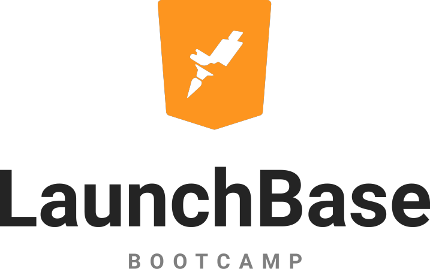

# Desafios do Bootcamp LaunchBase :rocket:

<h1 align=center>

</h1>

## 📜 Sobre
Aqui estão as resoluções dos desafios feitos durante o **Bootcamp LaunchBase**.

## ⚡ Tecnologias Utilizadas 
- JavaScript
- HTML
- CSS
- Node.Js
- Nunjucks
- Express

## ✅ Status do Bootcamp
- Em andamento

## 📝 Licença
Esse projeto está sob a licença MIT. Veja o arquivo [LICENSE](LICENSE) para mais detalhes.
